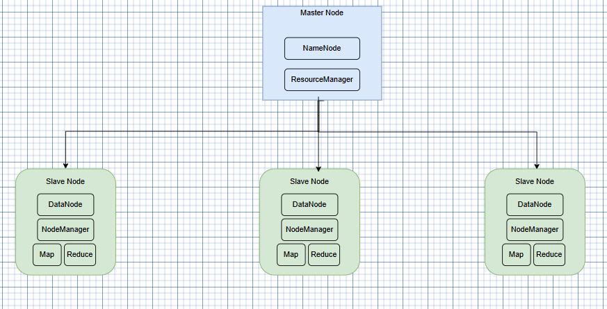

# Hadoop Cluster Architecture



## 🐘 Qu'est-ce que Hadoop ?

**Apache Hadoop** est un framework open-source développé par Apache Software Foundation qui permet le stockage et le traitement distribué de très grands ensembles de données (Big Data) sur des clusters de serveurs utilisant du matériel standard (commodity hardware).

### 🎯 Objectifs principaux

Hadoop a été conçu pour résoudre les défis du Big Data :
- **Volume** : Gérer des pétaoctets de données
- **Vélocité** : Traiter rapidement des flux de données massifs
- **Variété** : Supporter différents types de données (structurées, semi-structurées, non-structurées)
- **Économie** : Utiliser du matériel standard plutôt que des serveurs coûteux

### 🏆 Avantages clés de Hadoop

| Avantage | Description |
|----------|-------------|
| 💰 **Économique** | Utilise du matériel standard (commodity hardware) au lieu de serveurs propriétaires coûteux |
| 📈 **Scalable** | Passage à l'échelle horizontal simple : ajoutez des serveurs pour augmenter la capacité |
| 🔄 **Tolérant aux pannes** | Les données sont répliquées automatiquement. Si un nœud tombe, le système continue de fonctionner |
| ⚡ **Performant** | Traitement parallèle massif grâce à la distribution des données et des calculs |
| 🔓 **Flexible** | Stocke tous types de données sans schéma prédéfini (schema-on-read) |
| 🌐 **Open Source** | Gratuit, avec une large communauté et un écosystème riche |

### 🧩 Écosystème Hadoop

Hadoop n'est pas seul ! Il fait partie d'un vaste écosystème :

**Stockage et données :**
- 🗄️ **HDFS** : Système de fichiers distribué
- 🐝 **Hive** : Data warehouse et requêtes SQL sur Hadoop
- 🐷 **Pig** : Langage de traitement de données de haut niveau
- 📊 **HBase** : Base de données NoSQL distribuée

**Traitement et calcul :**
- 🗺️ **MapReduce** : Framework de traitement par lots original
- ⚡ **Spark** : Moteur de traitement en mémoire ultra-rapide
- 🌊 **Storm** : Traitement de flux en temps réel
- 🔥 **Flink** : Traitement de flux et par lots unifié

**Ingestion de données :**
- 🚰 **Flume** : Collecte et agrégation de logs
- 🔌 **Sqoop** : Transfert entre Hadoop et bases relationnelles
- 🌪️ **Kafka** : Plateforme de streaming distribué

**Gestion et coordination :**
- 🦓 **ZooKeeper** : Service de coordination distribué
- 🎯 **Oozie** : Ordonnanceur de workflows
- 👁️ **Ambari** : Gestion et monitoring de cluster

### 📊 Cas d'usage réels

**Entreprises utilisant Hadoop :**
- 🔍 **Yahoo!** : Indexation web et personnalisation (créateur initial de Hadoop)
- 📘 **Facebook** : Analyse de données utilisateurs et machine learning
- 🛒 **eBay** : Recommandations et analyse de comportements d'achat
- 🎬 **Netflix** : Recommandations de contenu et analyse de streaming
- 💳 **Visa** : Détection de fraudes en temps réel
- 🚕 **Uber** : Analyse de trajets et optimisation de prix

**Domaines d'application :**
- 🏦 Finance : Analyse de risques, détection de fraudes
- 🏥 Santé : Analyse de données médicales, recherche génomique
- 🛍️ E-commerce : Recommandations produits, analyse de tendances
- 📱 Télécoms : Analyse de réseaux, optimisation QoS
- 🏭 Industrie : Maintenance prédictive, IoT
- 🎮 Gaming : Analyse comportementale, anti-triche

### ⚙️ Les 4 composants principaux de Hadoop

1. **HDFS (Hadoop Distributed File System)**
   - Système de stockage distribué
   - Réplication automatique des données
   - Tolérance aux pannes

2. **YARN (Yet Another Resource Negotiator)**
   - Gestionnaire de ressources du cluster
   - Allocation de CPU/RAM
   - Planification des jobs

3. **MapReduce**
   - Framework de programmation pour traitement parallèle
   - Divise les tâches en Map (transformation) et Reduce (agrégation)

4. **Hadoop Common**
   - Bibliothèques et utilitaires communs
   - Support des autres modules Hadoop

### 🔄 Évolution de Hadoop

| Version | Année | Changement majeur |
|---------|-------|-------------------|
| Hadoop 1.x | 2011 | MapReduce + HDFS monolithique |
| Hadoop 2.x | 2013 | Introduction de YARN (séparation stockage/calcul) |
| Hadoop 3.x | 2017 | Erasure Coding, amélioration performances, support containers |

---

## 📋 Vue d'ensemble de l'architecture

Ce document décrit l'architecture d'un cluster Hadoop distribué, composé d'un nœud maître (Master Node) et de plusieurs nœuds esclaves (Slave Nodes). L'architecture combine HDFS (Hadoop Distributed File System) pour le stockage et YARN (Yet Another Resource Negotiator) pour la gestion des ressources et l'exécution des tâches.

## 🏗️ Architecture

### Master Node (Nœud Maître)

Le nœud maître orchestre l'ensemble du cluster et contient deux composants principaux :

#### 1️⃣ NameNode (HDFS)
**Le cerveau du stockage**

Le NameNode est responsable de la gestion des métadonnées du système de fichiers HDFS.

**Responsabilités :**
- 📁 Gestion des métadonnées (structure des fichiers et répertoires)
- 🗺️ Mapping des blocs de données
- 📊 Informations sur l'état et la disponibilité des DataNodes
- 🔐 Gestion des permissions et de la sécurité

#### 2️⃣ ResourceManager (YARN)
**Le cerveau du calcul**

Le ResourceManager coordonne l'allocation des ressources pour toutes les applications du cluster.

**Responsabilités :**
- 💻 Gestion des ressources CPU/RAM du cluster
- 📅 Scheduler pour la planification des jobs
- 📦 Allocation des containers aux applications
- 🎯 Gestion du cycle de vie des jobs
- 📥 Réception des demandes d'applications (Spark, MapReduce, etc.)

---

### Slave Nodes (Nœuds Esclaves)

Chaque nœud esclave contient deux composants qui travaillent en collaboration :

#### 1️⃣ DataNode (HDFS)
**Le stockage physique des données**

**Responsabilités :**
- 💾 Stockage des blocs de données physiques
- 🔄 Réplication des blocs selon le facteur de réplication configuré
- 💓 Envoi de heartbeats réguliers au NameNode
- 📊 Rapport d'utilisation du stockage

**Comment fonctionne le stockage ?**

Les fichiers HDFS sont découpés en blocs (128 MB par défaut).

**Exemple :**
```
Fichier de 300 MB →
├── Block1 (128 MB)
├── Block2 (128 MB)
└── Block3 (44 MB)
```

Ces blocs sont :
- Répartis sur plusieurs DataNodes
- Répliqués (généralement 3 copies par défaut)
- Distribués pour garantir la tolérance aux pannes

#### 2️⃣ NodeManager (YARN)
**L'agent d'exécution local**

**Responsabilités :**
- 🚀 Lancement et gestion des containers
- 📈 Surveillance de l'utilisation CPU/RAM
- ⚙️ Exécution des tâches (Map, Reduce, Spark tasks, etc.)
- 💓 Envoi de heartbeats au ResourceManager
- 📊 Rapport sur l'état des ressources locales

---

## 🔄 Flux de données et d'exécution

### Stockage de données (HDFS)
```
1. Client → envoie un fichier
2. NameNode → découpe le fichier en blocs et décide du placement
3. DataNodes → stockent les blocs et les répliques
4. DataNodes → confirment le stockage au NameNode
```

### Exécution de jobs (YARN)
```
1. Application → demande des ressources au ResourceManager
2. ResourceManager → alloue des containers sur les NodeManagers
3. NodeManagers → lancent les containers et exécutent les tâches
4. NodeManagers → rapportent l'avancement au ResourceManager
```

---

## 💡 Caractéristiques clés

### Haute disponibilité
- ✅ Réplication des blocs de données
- ✅ Tolérance aux pannes de nœuds
- ✅ Redistribution automatique des données

### Scalabilité
- ✅ Ajout de nœuds à chaud
- ✅ Distribution automatique de la charge
- ✅ Passage à l'échelle horizontal

### Performance
- ✅ Traitement parallèle des données
- ✅ Data locality (traitement près des données)
- ✅ Optimisation des ressources

---

## 📊 Configuration typique

| Paramètre | Valeur par défaut | Description |
|-----------|-------------------|-------------|
| Taille de bloc | 128 MB | Taille des blocs HDFS |
| Facteur de réplication | 3 | Nombre de copies par bloc |
| Heartbeat interval | 3 secondes | Fréquence des heartbeats |
| Block report interval | 6 heures | Fréquence des rapports de blocs |

---

## 🚀 Cas d'usage

Cette architecture Hadoop est idéale pour :

- 📊 Big Data Analytics
- 🔍 Data Mining et Machine Learning
- 📈 Processing de logs à grande échelle
- 🗄️ Data Warehousing distribué
- 🔄 ETL (Extract, Transform, Load) massif

---

## 🆚 Hadoop vs autres solutions

### Hadoop vs Bases de données traditionnelles

| Critère | Hadoop | RDBMS traditionnel |
|---------|--------|-------------------|
| **Volume de données** | Pétaoctets+ | Téraoctets max |
| **Type de données** | Structurées, semi-structurées, non-structurées | Structurées uniquement |
| **Schéma** | Schema-on-read (flexible) | Schema-on-write (rigide) |
| **Coût** | Matériel standard, faible coût | Matériel spécialisé, coût élevé |
| **Traitement** | Batch (par lots) | Transactionnel (OLTP) |
| **Scalabilité** | Horizontale (ajouter des serveurs) | Verticale (améliorer le serveur) |
| **Vitesse** | Optimisé pour throughput | Optimisé pour latence |

### Hadoop vs Spark

| Aspect | Hadoop MapReduce | Apache Spark |
|--------|------------------|--------------|
| **Vitesse** | Plus lent (lecture/écriture disque) | 10-100x plus rapide (en mémoire) |
| **Traitement** | Batch uniquement | Batch, streaming, ML, graphes |
| **Complexité** | Code plus verbeux | API plus simple et intuitive |
| **Tolérance aux pannes** | Réplication des données sur disque | RDD (Resilient Distributed Datasets) |
| **Usage** | Jobs MapReduce classiques | Analyses complexes, ML, temps réel |

💡 **Note** : Spark peut fonctionner **sur** Hadoop YARN, utilisant HDFS pour le stockage !

---

## 🛠️ Bonnes pratiques

### Configuration du cluster

**Taille des nœuds :**
- 👑 **Master Node** : CPU puissant, RAM élevée (64-128 GB), stockage SSD pour métadonnées
- 💪 **Slave Nodes** : Équilibre CPU/RAM/Stockage, privilégier plus de nœuds que de gros nœuds

**Réplication :**
- 📦 Facteur de réplication recommandé : **3** (bon compromis fiabilité/espace)
- 🔐 Pour données critiques : 5
- 💾 Pour données temporaires : 1-2

### Optimisation des performances

**1. Data Locality (Localité des données)**
```
Principe : Déplacer le calcul vers les données, pas l'inverse
- Meilleur : Process et données sur le même nœud
- Bien : Process et données dans le même rack
- Acceptable : Process et données dans des racks différents
```

**2. Taille des blocs**
- 📏 Défaut : 128 MB
- 📈 Grands fichiers (logs, archives) : 256 MB ou 512 MB
- 📉 Petits fichiers : Éviter ! Regrouper dans des archives

**3. Compression**
- ✅ Activer la compression (Snappy, LZO, Gzip)
- 💾 Économie d'espace : 60-90%
- ⚡ Réduction du I/O réseau

### Sécurité

**Kerberos** : Authentification forte
```
- Active Directory integration
- Single Sign-On (SSO)
- Chiffrement des communications
```

**Contrôle d'accès :**
- 🔐 ACL (Access Control Lists) sur HDFS
- 👥 Gestion des quotas par utilisateur/groupe
- 🔒 Chiffrement des données au repos et en transit

### Monitoring

**Métriques clés à surveiller :**
- 💓 Heartbeats des DataNodes et NodeManagers
- 💾 Utilisation du stockage HDFS (seuil : 80%)
- 🧮 Utilisation CPU/RAM des nœuds
- 📊 Nombre de blocs corrompus ou manquants
- ⏱️ Durée d'exécution des jobs
- 🌐 Bande passante réseau

**Outils de monitoring :**
- 📊 Ambari
- 📈 Cloudera Manager
- 🔍 Ganglia
- 📉 Nagios
- 🎯 Prometheus + Grafana

---

## 🚀 Guide de démarrage rapide

### Prérequis
```bash
- Java 8 ou 11
- SSH configuré entre tous les nœuds
- NTP synchronisé pour l'horloge
- Désactiver le firewall ou ouvrir les ports requis
```

### Installation basique (mode pseudo-distribué)

```bash
# 1. Télécharger Hadoop
wget https://downloads.apache.org/hadoop/common/hadoop-3.3.6/hadoop-3.3.6.tar.gz
tar -xzf hadoop-3.3.6.tar.gz
cd hadoop-3.3.6

# 2. Configurer les variables d'environnement
export HADOOP_HOME=/path/to/hadoop-3.3.6
export PATH=$PATH:$HADOOP_HOME/bin:$HADOOP_HOME/sbin

# 3. Formater le NameNode
hdfs namenode -format

# 4. Démarrer HDFS
start-dfs.sh

# 5. Démarrer YARN
start-yarn.sh

# 6. Vérifier l'installation
hdfs dfsadmin -report
yarn node -list
```

### Commandes HDFS essentielles

```bash
# Lister les fichiers
hdfs dfs -ls /

# Créer un répertoire
hdfs dfs -mkdir /user/data

# Copier un fichier local vers HDFS
hdfs dfs -put local_file.txt /user/data/

# Copier un fichier HDFS vers local
hdfs dfs -get /user/data/file.txt local_file.txt

# Voir le contenu d'un fichier
hdfs dfs -cat /user/data/file.txt

# Supprimer un fichier
hdfs dfs -rm /user/data/file.txt

# Voir l'utilisation du stockage
hdfs dfs -du -h /

# Vérifier la santé du système
hdfs fsck / -files -blocks -locations
```

---

## 🎓 Concepts avancés

### 1. Rack Awareness (Conscience des racks)

Hadoop optimise le placement des répliques selon la topologie réseau :

```
Bloc de données → 3 répliques :
├── Réplique 1 : Même nœud (local)
├── Réplique 2 : Autre nœud, même rack
└── Réplique 3 : Nœud dans un rack différent
```

**Avantages :**
- 🛡️ Protection contre les pannes de rack
- ⚡ Optimisation de la bande passante réseau
- 📊 Équilibrage de charge

### 2. Balancing des données (Data Balancing)

Avec le temps, les données peuvent être déséquilibrées :

```bash
# Lancer le balancer (redistribue les données)
hdfs balancer -threshold 10

# threshold : différence max acceptable entre nœuds (%)
```

### 3. Federation (Fédération HDFS)

Pour les très grands clusters :
- 🔢 Multiple NameNodes indépendants
- 📦 Chaque NameNode gère un namespace distinct
- 📈 Scalabilité du namespace (milliards de fichiers)

### 4. High Availability (HA)

Configuration pour tolérer la panne du NameNode :

```
Active NameNode ←→ Standby NameNode
         ↓
   Journal Nodes (Quorum)
         ↓
     ZooKeeper
```

**Bénéfices :**
- ✅ Pas de Single Point of Failure
- 🔄 Failover automatique
- ⏱️ Pas de downtime lors des maintenances

---

## 📚 Ressources et références

### Documentation officielle
- 📖 [Apache Hadoop Documentation](https://hadoop.apache.org/docs/)
- 🗂️ [HDFS Architecture Guide](https://hadoop.apache.org/docs/stable/hadoop-project-dist/hadoop-hdfs/HdfsDesign.html)
- 🎯 [YARN Architecture](https://hadoop.apache.org/docs/stable/hadoop-yarn/hadoop-yarn-site/YARN.html)
- ⚙️ [Hadoop Configuration](https://hadoop.apache.org/docs/stable/hadoop-project-dist/hadoop-common/ClusterSetup.html)

### Tutoriels et cours
- 🎓 [Hadoop Tutorial - Apache](https://hadoop.apache.org/docs/stable/hadoop-mapreduce-client/hadoop-mapreduce-client-core/MapReduceTutorial.html)
- 📺 [Cloudera Training](https://www.cloudera.com/about/training.html)
- 💻 [Hortonworks Tutorials](https://www.cloudera.com/tutorials.html)
- 📚 Livre : "Hadoop: The Definitive Guide" par Tom White

### Communauté
- 💬 [Stack Overflow - Hadoop Tag](https://stackoverflow.com/questions/tagged/hadoop)
- 🐦 [Apache Hadoop Twitter](https://twitter.com/hadoop)
- 📧 [Mailing Lists](https://hadoop.apache.org/mailing_lists.html)
- 💡 [JIRA - Bug Tracking](https://issues.apache.org/jira/projects/HADOOP)

### Outils et distributions
- ☁️ [Cloudera Data Platform](https://www.cloudera.com/)
- 🌊 [Amazon EMR](https://aws.amazon.com/emr/) (Elastic MapReduce)
- 🔷 [Azure HDInsight](https://azure.microsoft.com/en-us/services/hdinsight/)
- 🟢 [Google Cloud Dataproc](https://cloud.google.com/dataproc)

---

## ❓ FAQ (Questions fréquentes)

**Q: Quelle est la différence entre Hadoop et Spark ?**
> R: Hadoop est un framework complet (stockage + calcul), tandis que Spark est principalement un moteur de calcul qui peut utiliser HDFS pour le stockage. Spark est 10-100x plus rapide car il travaille en mémoire.

**Q: Combien de nœuds faut-il pour démarrer avec Hadoop ?**
> R: Vous pouvez commencer avec 3-5 nœuds pour un cluster de test. En production, 10-20 nœuds minimum sont recommandés.

**Q: Hadoop peut-il gérer des petits fichiers ?**
> R: Techniquement oui, mais c'est inefficace. Hadoop est optimisé pour de gros fichiers (>128 MB). Pour les petits fichiers, utilisez des formats comme HAR (Hadoop Archive) ou SequenceFile.

**Q: Est-ce que Hadoop est mort avec l'arrivée du Cloud ?**
> R: Non ! Hadoop reste très utilisé, notamment dans les clouds (EMR, HDInsight). Beaucoup d'entreprises adoptent une approche hybride.

**Q: Quelle est la taille maximale d'un fichier dans HDFS ?**
> R: Théoriquement, HDFS peut gérer des fichiers de plusieurs pétaoctets. En pratique, cela dépend de la capacité totale de votre cluster.

**Q: Peut-on modifier un fichier dans HDFS ?**
> R: HDFS est un système "write-once, read-many". Vous ne pouvez pas modifier un fichier en place, mais vous pouvez le supprimer et le réécrire, ou ajouter à la fin (append).

---

## 🔮 L'avenir de Hadoop

### Tendances actuelles

**1. Cloud-native Hadoop**
- ☁️ Migration vers le cloud (AWS, Azure, GCP)
- 🎯 Séparation calcul/stockage (S3, Azure Blob)
- 💰 Modèle pay-as-you-go

**2. Intégration avec les technologies modernes**
- 🐳 Containerisation avec Kubernetes
- 🌊 Streaming avec Kafka et Flink
- 🧠 Machine Learning avec TensorFlow et PyTorch

**3. Évolution vers les Data Lakehouses**
- 🏠 Combinaison Data Lake + Data Warehouse
- ⚡ Formats modernes : Delta Lake, Apache Iceberg, Apache Hudi
- 📊 ACID transactions sur data lakes

### Hadoop 4.0 (en développement)

Améliorations prévues :
- 🚀 Support natif des containers
- ⚡ Performances améliorées
- 🔒 Sécurité renforcée
- 📦 Modernisation de l'architecture

---

## 📖 Glossaire

| Terme | Définition |
|-------|------------|
| **Block** | Unité de stockage de base dans HDFS (défaut : 128 MB) |
| **Cluster** | Ensemble de serveurs travaillant ensemble |
| **Commodity Hardware** | Matériel standard, non spécialisé, économique |
| **Container** | Allocation de ressources (CPU/RAM) sur un nœud pour exécuter une tâche |
| **Data Locality** | Principe d'exécuter les calculs près des données pour minimiser les transferts réseau |
| **DataNode** | Nœud esclave qui stocke les blocs de données |
| **Erasure Coding** | Technique de protection des données alternative à la réplication (Hadoop 3.x) |
| **Heartbeat** | Signal périodique envoyé par les nœuds pour indiquer qu'ils sont actifs |
| **HDFS** | Hadoop Distributed File System - système de fichiers distribué |
| **Job** | Tâche MapReduce ou application soumise au cluster |
| **MapReduce** | Framework de programmation pour le traitement parallèle |
| **Metadata** | Informations sur les fichiers (nom, taille, permissions, localisation des blocs) |
| **NameNode** | Nœud maître gérant les métadonnées HDFS |
| **Namespace** | Espace de noms du système de fichiers HDFS |
| **NodeManager** | Agent sur chaque nœud esclave qui gère l'exécution locale |
| **Rack** | Ensemble de serveurs physiquement groupés dans le datacenter |
| **Replication Factor** | Nombre de copies de chaque bloc (défaut : 3) |
| **ResourceManager** | Gestionnaire global des ressources du cluster |
| **Schema-on-Read** | Le schéma est appliqué lors de la lecture, pas lors de l'écriture |
| **Secondary NameNode** | Processus qui aide le NameNode avec les checkpoints (pas un backup !) |
| **Slave Node** | Nœud esclave qui exécute DataNode et NodeManager |
| **YARN** | Yet Another Resource Negotiator - gestionnaire de ressources |

---

## 🤝 Contribution

---

## 🤝 Contribution

Les contributions pour améliorer cette documentation sont les bienvenues ! 

### Comment contribuer ?

1. 🍴 **Fork** ce repository
2. 🌿 Créez votre branche (`git checkout -b feature/amelioration`)
3. ✍️ Committez vos changements (`git commit -m 'Ajout de nouvelles infos'`)
4. 📤 Pushez vers la branche (`git push origin feature/amelioration`)
5. 🎯 Ouvrez une **Pull Request**

### Idées de contribution

- 📝 Corriger des erreurs ou typos
- 🆕 Ajouter de nouveaux cas d'usage
- 🖼️ Améliorer les diagrammes
- 🌍 Traduire dans d'autres langues
- 💡 Partager des bonnes pratiques
- 📊 Ajouter des exemples de code

---

## 📝 Licence

Ce document est fourni sous licence **MIT** à des fins éducatives et de documentation.

```
MIT License

Copyright (c) 2026

Permission is hereby granted, free of charge, to any person obtaining a copy
of this documentation and associated files, to deal in the documentation without
restriction, including without limitation the rights to use, copy, modify, merge,
publish, distribute, sublicense, and/or sell copies of the documentation.
```

---

## 📧 Contact & Support

Pour toute question ou suggestion :
- 📝 Ouvrez une **Issue** sur GitHub
- 💬 Rejoignez la communauté Apache Hadoop
- 📚 Consultez la [documentation officielle](https://hadoop.apache.org/docs/)

---

## ⭐ Si ce README vous a été utile

N'hésitez pas à :
- ⭐ **Star** ce repository
- 🔄 **Fork** pour vos propres projets
- 📢 **Partager** avec vos collègues
- 💬 **Laisser un feedback**

---

<div align="center">

**Made with ❤️ for the Hadoop Community**


*Dernière mise à jour : Février 2026*

</div>